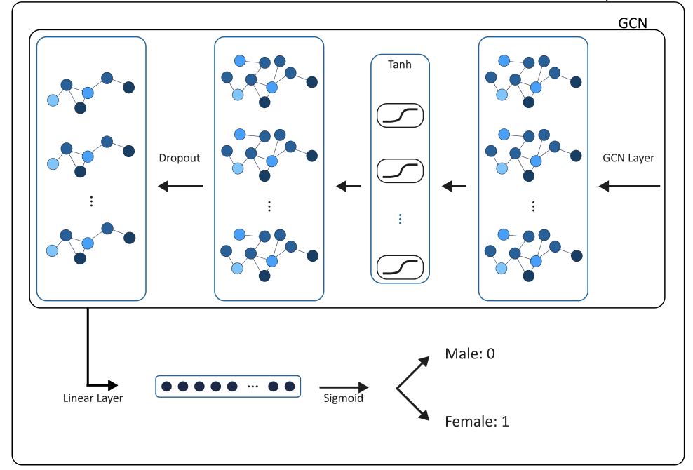
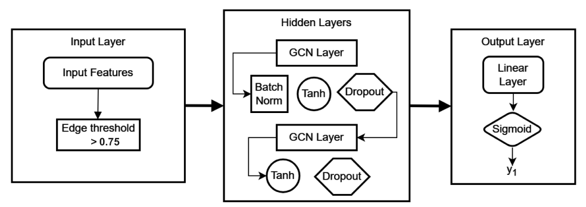
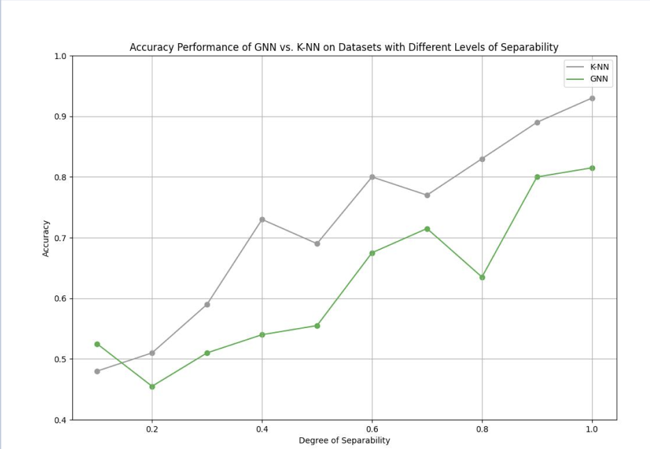
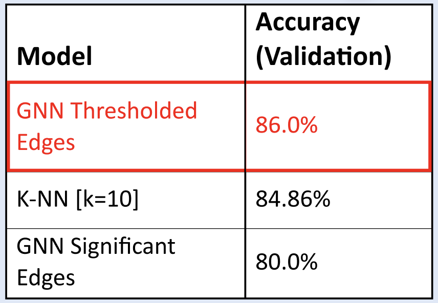
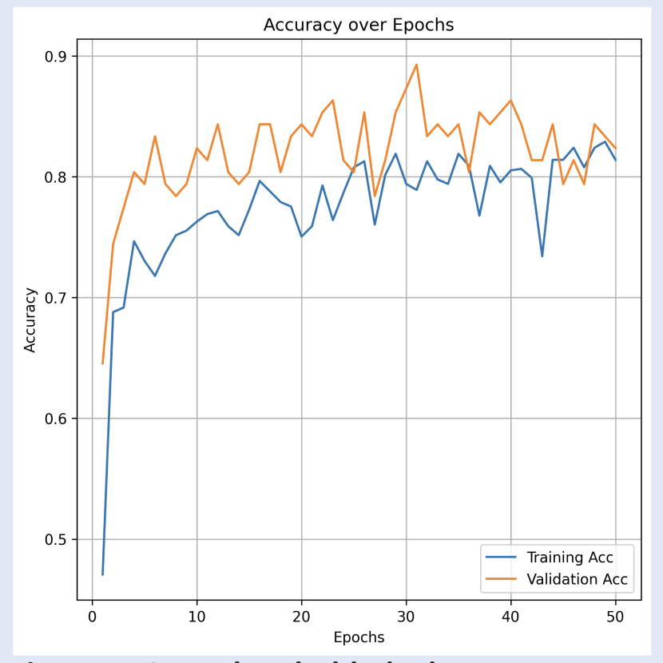
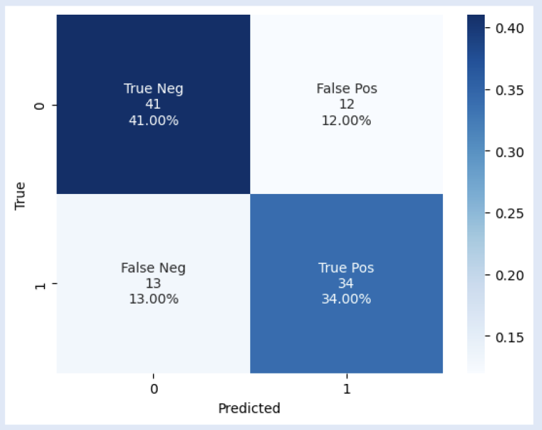
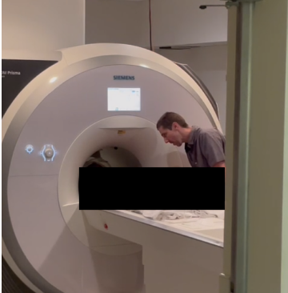
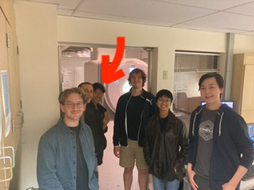

# Applications of Connectivity in the Human Brain Using Functional MRI data: Classification with Graph Neural Networks 

| Andrew Cheng | Daphne Fabella| Terho Koivisto | Daniel Zhang | Gabriel Riegner | Armin Schwartzman |
| ---| --- | ----| ----- | ----- | ----- |
apcheng@ucsd.edu | dfabella@ucsd.edu | tkoivisto@ucsd.edu | yiz029@ucsd.edu| gariegner@ucsd.edu | armins@ucsd.edu |

## Sources

||  |  |
|:--:|:--:|:--:| 
| [*Code*](https://github.com/AndrewCheng02/DSC180B-Capstone-ProjectA09) | [*Report*](./capstone_report.pdf) | [*Poster*](./capstone_poster.pdf) |

## Abstract

In our project, we developed classification models to discern gender difference from functional magnetic resonance imaging (fMRI) to examine the applicability of Graph Neural Networks (GNN) on resting state fMRI. By exploring brain network differences and use of data simulation with controllable parameters, we constructed a neural network classifier utilizing graph structure alongside a simple baseline model. The results show the two classes are separable when only comparing fMRI resting state data. Our research will walk through steps of statistical methods, simulation, and model description to accomplish our objective.

## Introduction

Functional magnetic resonance imaging still proves to be a key tool to deciphering the mysterious architecture of the brain after its first uses in the early nineties. Due to the high spatial resolution (in millimeters) and relative ease of getting a scan, data for fMRI scans has become highly available and useful. These scans still lack temporal resolution due to how fMRI blood-oxygen-level-dependent (BOLD) signals work, where it is the blood flow that is being measured rather than the signals in the brain. This will make our temporal resolution in seconds rather than some other scanning methods (e.g. MEG, EEG, NIRS)  that are in milliseconds. Understanding and simulating fMRI data is crucial for understanding the connectivity of the brain.

Our project will focus on data from the Human Connectome Project (HCP) Young Adult data release, which has a collection of 1,200 fMRI scanned adult brains. The data is in the form of voxels, which are pixels that exist in a three-dimensional space of a brain mapping to an intensity of a BOLD signal at a specific point in time. With the amount of different brains, it would be impossible to map one to one comparisons between specific voxel locations in the brain. So we use pre-processed data that shrinks the number of subjects to 1,003 subjects. We will later discuss the data in more detail. 

We are not the only ones to be interested in the differences of fMRI data in resting state between genders. A study by [Sie 2019](https://www.ncbi.nlm.nih.gov/pmc/articles/PMC6811649/) investigated age and gender differences in resting state functional connectivity. They found during rest females will have stronger correlations in the DMN than their male counterparts. While these differences were shown to wear off with age, this still proves there exist possible indicators to be found in fMRI data.

For our neural network based classifier, we must explain some important considerations. For data pre-processing we explain changes we might need to make to data. Simulate an environment to prove the classification is practicable from correlation data. Finally explain our exploratory data analysis to display significant differences in the data between genders.

## Background

HCP is a research initiative that aims to map the structure and connections in the brain
through fMRI. It started in 2009, and the project has become a joint effort involving various
institutions in the United States. Our data comes from the HCP young adult study which
released 1200 young adult subjects in 2018. The subject’s data has been prepossessed to
contain the denoised transformed network matrices and time series for each subject. The
data also includes many features such as age and gender that will be useful in building
our classification models. The data also includes the ICA decomposition atlas. (A choice
of mapping for assigning the brain regions) Having the atlas allows us to train other fMRI
scans outside of HCP on our model by transforming any Nifti file (fMRI 4D raw data) into
a network matrix with the same preprocessing methods as the HCP data.

The input for our model will be the pairwise correlation matrix generated by the fMRI time
series also known as the network matrix. A common approach for estimating functional
connectivity is finding the correlation values between two brain regions’ activity over time.
The fMRI scans used to generate the HCP data are pre-processed and analyzed to provide
4950 pairwise correlations for each subject. These pairwise correlations are calculated from
the 100 regions found via PCA and ICA.

When analyzing a dataset encompassing more than two brain regions, a correlation matrix
can be employed to explore the linear relationships among all possible pairs. We perform a
series of analyses on these correlation matrices to explore the possible distinctions between
the functional connectivity of the male brain and the female brain.

## Graph Neural Network (GNN)

The input to our Graph Neural Network (GNN) consists of pre-processed ICA components provided by the previously discussed HCP fMRI data releases for 1,003 young adults. Each subject is associated with metadata including age range and gender. Gender information is extracted and used as a label for our classification task. From this data, meaningful edges are extracted through EDA significant edges, indicating important connections between components for distinguishing gender within the graph.

## GNN Structure

 

**Figure 1.**
*The GNN processes the graph data for each subject iteratively examining the relations of neighboring significantly connected components to a specific component in the graph. By running the network by subject, over time it will recognize important indicators in the structure found by edges as well as correlation weights on specific components. It summarizes these relationships and updates the state of each component per subject iteratively using GNN operations. The process is repeated until the network achieves satisfactory accuracy on both the training and validation sets. GNNs leverage parallel computing methods, making them suitable for efficient training on cloud computing platforms. Despite this, most of our training has run on memory of a personal computer.*

## GNN Architecture

**Figure 2.**
*From empirical findings of running with different hyperparameters, general rules of thumb for neural networks have been useful. This mainly includes having a tuned learning rate, using activation functions on each hidden layer, changing the shape of the data to a higher dimension then reducing the dimension to, and finally having a linear layer before output. Some changes from usual neural networks are using the tanh activation function since our data needs to be analyzed for positive and negative correlation values. Utilizing batchnorm on each hidden layer proved to be useful, which was inspired from a paper with a similar task. Article by **Hough_2022** describes the usefulness of batchnorm which is most likely due to its benefits to accelerate training per epochs. Overall there is no single architecture that will work for any given task. As tested by using same architecture on simulated fMRI data vs. real fMRI data, the results vary.*

## Results

These are the results of our findings. We decided to use KNN as a baseline classifier. Due to the limited amount of data it would be easy to assume that KNN would perform better since it works well with less data versus a GNN that needs lots of data to train its hyper parameters. As the amount of fMRI data becomes more and more accessible we assume that the GNN will out perform the KNN not only in accuracy but computationally in speed. As the amount the of data points increases the KNN algorithm becomes slower whereas the GNN becomes more accurate.

|||
|:--:|:--:| 
| **Figure 3. GNN vs. K-NN: Classification task performance on Separable (Simulated) Data.** There is a positive relationship between accuracy and separability of groups for both models. | **Figure 4. GNN vs. KNN: Classification task performances on HCP Data.** The GNN on thresholded edges had the highest performance at 86.00% accuracy.|

| ||
|:--:|:--:|
| **Figure 5. GNN Thresholded Edges accuracy per epoch. Monotonic increase of accuracy over epochs indicates effective classification-task performance.** | **Figure 6. GNN Thresholded Edges confusion table.** F1-score of 0.73. The model performed generally better at predicting males than females when given the validation dataset.|

## Testing!

One of our very own group members decided to be put into the MRI closet and be tested on our very own model! >:)

 <-- Sent to the Shadow Realm

We get this connectome plot of their brain (Each line represents a connection in the brain network) and along side it we have a the average HCP connectomes for male and females.

<iframe src="./html/andrew_view.html" width=600mm height=450mm></iframe> 

<iframe src="./html/male_view.html" width=480mm height=350mm></iframe> <iframe src="./html/female_view.html" width=480mm height=350mm></iframe>

Can you spot the difference and predict if our group member is male and female??

Click for REVEAL

Woahh it's Andrew and guess what our GNN predicted correctly that he's male!! Woohoo

